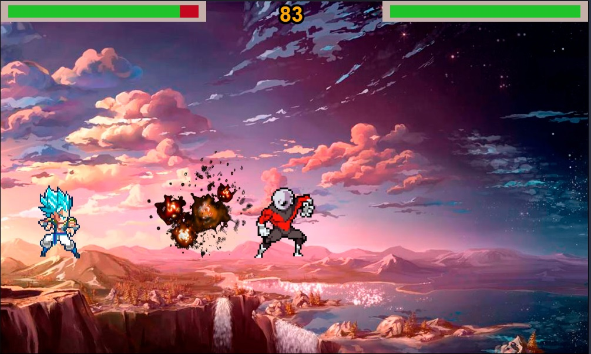

# JS WARRIORS Z

## Description

This game is based on the fascinating world of Dragon Ball. You will have to defeat the enemy before he kills you, or before time runs out.

## User stories MVP

- The player must be painted on the correct starting position.
- User can move right, left, up or down.
- User can not move if collides with screen limits and markers place.
- The enemy must be painted on the opposite side.
- User can hit space button and throw a ChakraBall.
- ChakraBall throw are limited by time.
- Add animations to the player actions.
- Control that the players cannot cross each other on the x-axis.
- Display a winner or loser message on the screen.
- Develop the functionality for the enemy to attack automatically.
- Develop some markers to visualize the health of each player.
- Add a timer for the end of the game.
- Develop methods to able player/enemy to realice attack actions and receive damage.
- Use DOM Manipulation to able to play a new game using a button.
- Implement a method for managing collisions. Collisions will be between melee characters and between chakraballs.
- Develop a class to able drawing explosions in whatever screen point.
- Show an image with the how to play information.
- Use DOM Manipulation to able choose player and enemy by clicking mouse.
- Set audio effects to the whole game.
- Add CSS Styles to get a more beautiful appearance.
- When a new game stars, a random background image will be showed.
- When a new game stars, a random sound will be played.

## User stories Backlog

- Implement multiplayer combat.

## File structure

- <code>animationexplosion.js</code>: This class together with its methods is responsible for managing the explosion animation of the chakraballs. 
- <code>animationplayer.js</code>: The purpose of this class is to be able to reproduce an action animation of the character that invokes its methods.
- <code>assets.js</code>: Contains all the management of loading the images and some variables necessary for the game. 
- <code>chakraball.js</code>: Contains a class that manages the movement and duration of a chakraball.
- <code>enemy.js</code>: This class inherits the attributes and methods of a player, and overrides some methods for the enemy to move through the screen.
- <code>game.js</code>: Manage the beginning of the game, the drawing of the characters and the control of their life level and also manage the game over.
- <code>player.js</code>: Contains all the attributes and methods of a player to manage it. Contain all the possible actions that a player can do.
- <code>scripts.js</code>: Contains all the DOM manipulation code to start the game. Manage the selection of characters at the beggining of the game.
- <code>sound.js</code>: Contains a special function that allow to reproduce the audio sounds. 

## Useful links

- [Presentation slides](https://slides.com/d/iRCC3zs/live#/jswarriorsz)
- [Deployed game](https://danignz.github.io/ih-project1-template/)
